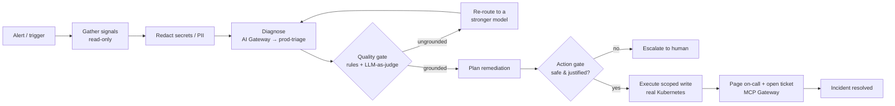

I designed the whole system around **four Pydantic contracts** — get the boundaries right and everything else composes.

| Contract | Role |
|---|---|
| `Signals` | The read-only ground truth: `services`, `recent_deploys`, `metrics`, `logs`, `protected_resources`. |
| `Diagnosis` | The structured LLM output: `hypothesis`, `suspected_resource`, `suspected_deploy_sha`, `confidence` (0–1), `recommended_action`. Never prose. |
| `ProposedAction` | A typed tool call (`rollback_deploy` / `scale_service`) with an explicit blast-radius `scope`. |
| `Verdict` | A guardrail result — `passed`, the individual `checks`, and human-readable `reasons` (rendered live in the UI). |

## The triage loop

## RunEvents over SSE

Everything streams as `RunEvent`s — `step`, `gate`, `fallback`, `action`, `blocked`, `breaker`, `done` — over Server-Sent Events, so the dashboard is just a live view of the agent's decision trail.

## The InfraBackend interface

The cluster sits behind one interface, `InfraBackend`, with two implementations:

- **`K8sBackend`** — the real `kind` cluster. Reads ReplicaSet revisions and ready-ratios, performs real image rollbacks and scales.
- **`MockBackend`** — a deterministic fixture for tests. It mirrors the same newest-first deploy ordering as the real one so behavior is identical across both.

The agent never knows which one it's driving.

## The triage loop, step by step

This is `run_hardened`, and every step is failure-aware:

1. **Trigger** — an alert opens a triage run.
2. **Gather** — pull `Signals` from the cluster. Nothing destructive is reachable on this path; `prod-db` and `payments` are excluded from the actionable `services` list at the source.
3. **Redact** — mask secrets and PII in the gathered logs *before the model ever sees them* (the cluster signals deliberately include a leaked `postgres://…` credential line so you can watch this work).
4. **Diagnose** — the gateway routes to `prod-triage` and returns a structured `Diagnosis`.
5. **Quality gate** — rule-based groundedness (`suspected_resource` must be a real service, `suspected_deploy_sha` must be a real recent deploy, `confidence` ≥ 0.5) **plus an independent LLM-as-judge** that reasons about whether the action is actually justified by the evidence. **Fail → re-route** to a stronger model and re-diagnose.
6. **Plan** — turn the validated diagnosis into a typed `ProposedAction`.
7. **Action gate** — before any write: reject `scope=all` (blast radius), reject protected resources, confirm the target exists, and confirm the action matches the diagnosis. **Fail → block and escalate** — the destructive action simply never runs.
8. **Execute** — only a validated action runs, against the real cluster, through a narrow write path; tool failures are caught and degrade to a human hand-off.
9. **Notify** — page on-call and open an incident ticket through the MCP Gateway.
10. **Resolve** — re-gather to confirm the heal (`error_rate → 0.0`).

The `run_naive` path skips steps 3, 5, 7, and the tool-failure handling — it trusts the first output and has every tool in hand, so it executes the catastrophe. That contrast *is* the demo.
