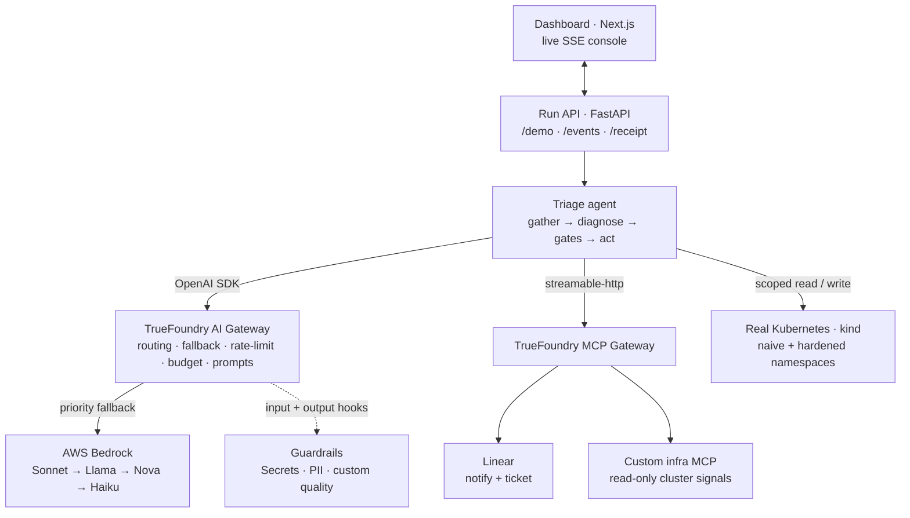

Every capability below is wired through the platform, not faked. Here's the system view — where each piece lives and how it connects:

## AI Gateway + Virtual Models

I point the OpenAI SDK at the gateway (`base_url` + a virtual key) and call a single **virtual model, `prod-triage`**, that I configured with a **priority fallback chain over AWS Bedrock**: **Claude Sonnet → Llama 4 Maverick → Amazon Nova Pro → Claude Haiku**, with retry/fallback on `401/403/404/408/429/5xx`. The agent calls one model name; the gateway handles failover.

I also attached a **rate-limit policy** (to force and demonstrate live failover) and a **budget/cost-limit policy** across the chain. Every call carries `X-TFY-LOGGING-CONFIG`, so request traces, fallback events, and per-model cost land in **AI Monitoring**.

## Guardrails

I registered a guardrail group and applied it to `prod-triage` with a policy that runs on both the **LLM Input** and **LLM Output** hooks:

- **Input (redact):** native **Secrets Detection** + **PII/PHI** guardrails, in *mutate* mode, mask credentials/tokens/PII before the model sees them.
- **Output (validate):** a **custom guardrail** I built and host (`/tfy/quality`) validates the model's response shape and confidence.
- **In-agent (the core fail-safe logic):** the groundedness, blast-radius and justification checks run *in the agent* as pure, unit-tested functions, backed by the LLM-as-judge — so a wrong output can't reach the cluster even if a platform check is lenient.

## MCP Gateway

- **Official remote MCP (Linear):** on resolution, the agent pages on-call and files an incident ticket through a **curated virtual MCP server** that exposes *only* safe tools (ticket creation), with destructive tools toggled off and auth managed centrally.
- **Custom MCP endpoint:** I built a read-only "infra" MCP server with FastMCP (`get_signals`, `deployment_status`, `namespaces`) and connected it to the gateway over streamable-http, so live cluster state is reachable through the MCP layer with a full audit trail. I kept it strictly read-only by design — no destructive tool is ever exposed.

## Prompts

The diagnosis system prompt is **versioned in the prompt registry** and fetched at runtime via the TrueFoundry SDK, with a production-grade local prompt as a fallback if the registry is unreachable.
